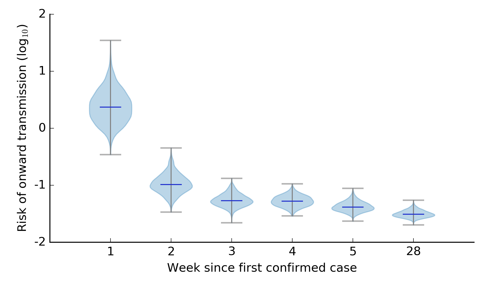
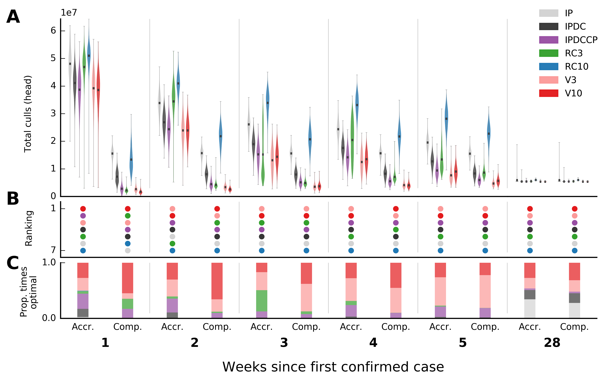
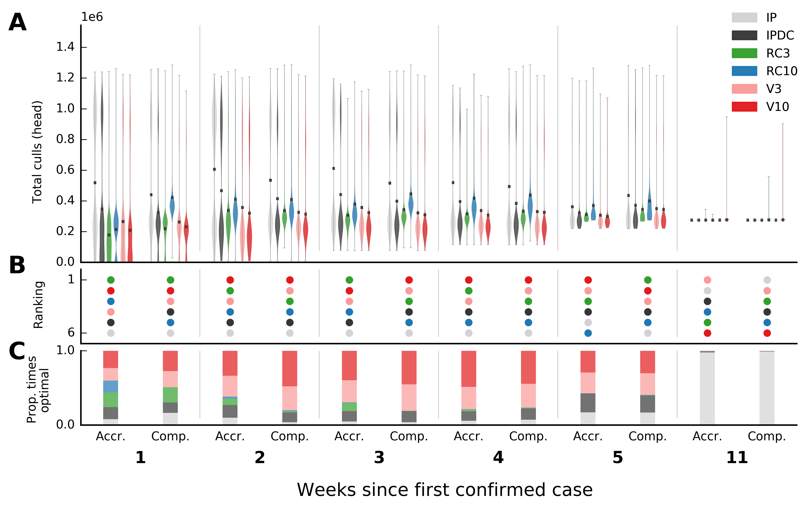
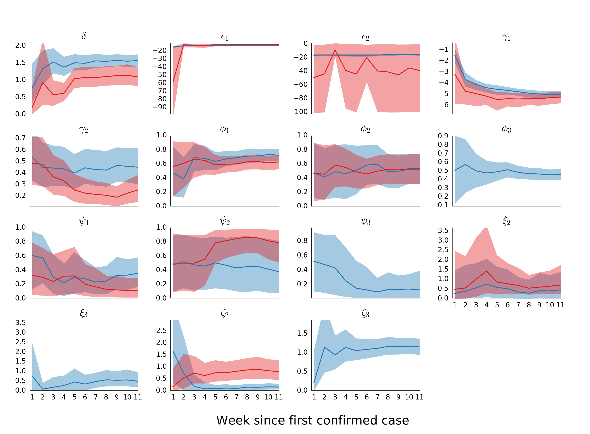
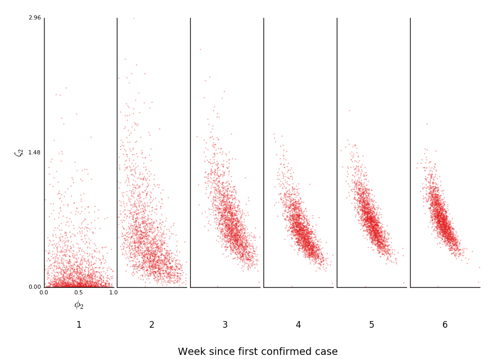

# Overview 

Code to reproduce figures from Probert et al. (2018) Real-time decision-making during emergency disease outbreaks.  *PLOS Computational Biology*.  

### Data set-up

All parameter estimate data and simulation output are available via the Dryad Digital Repository with DOI of [doi:10.5061/dryad.gr656gk](https://doi.org/10.5061/dryad.gr656gk).  After download, data should be arranged in the following manner:
```
fmd_realtime_decisionmaking/
    |
    data/
        |
        /parameters_miyazaki.csv
        /parameters_uk.csv
        /simulations_miyazaki.csv
        /simulations_uk.csv
```

### Generating figures

Figures were generated using Python (version 3.6.3) and the following packages: `numpy` (version 1.14.2), `pandas` (version 0.22.0), `matplotlib` (version 2.2.2).  Figures can be generated in `.png` format by running the script [`run.sh`](run.sh) from the main project folder or using the commands listed by individual figures below.  


### Notes

Excluded from the data repository are code for figures that depend upon confidential data (figures S1, S2, S7 and S8). All data for figures S2 and S8 is available if researchers follow the access details we have provided for the Miyazaki data (see the manuscript for details). Figures S1 and S7, however, rely on the outbreak data for the UK outbreak in 2001. Data on the 2001 UK FMD outbreak are available on request from the Department for Environment, Food, and Rural Affairs (DEFRA) of the government of the United Kingdom. Access to this data, including appropriate DEFRA contact information, is accessed through the [DEFRA website](https://www.gov.uk/government/organisations/department-for-environment-food-rural-affairs).  


# Main text figures

## Figure 1

```bash
python plot_risk_measure_individual.py \
    --filetype=.png \
    --country=uk \
    --outfilename=fig_1 \
    --weeks 1 2 3 4 5 28
```



**Fig 1. Instantaneous risk of onward transmission of foot-and-mouth disease in UK 2001 in first 5 weeks and the final week**  Calculated as the infectious pressure from an average-sized infectious farm to an average-sized susceptible farm integrated across both the joint parameter distribution at the time point in question, and from 0 to 20km.  Note that the instantaneous risk of transmission indicates the overall relative risk of transmission, which does not have a direct epidemiological interpretation but provides a direct comparison across weeks.  

## Figure 2

```bash
python plot_three_panel_plot.py \
    --filetype=.png \
    --country=uk \
    --outfilename=fig_2 \
    --randomseed=100 \
    --weeks 1 2 3 4 5 28
```



**Fig 2. Projections and relative rankings of various control strategies of total animals culled, and estimates of infected but undetected farms, for the first five weeks and the final week of the 2001 foot-and-mouth disease outbreak in UK.**  A) Distribution of total animal culls from forward simulations, here shown as kernel density estimates (violin plots), are seeded either using parameter estimates from the end of the outbreak (‘complete’), or at the specific time point (‘accrued’).  B) Rankings of control interventions are according to median projections.  Proportion (C) of times each control was optimal when bootstrap samples are made from distributions in (A).  For all time points see figs S9 and S10.  

## Figure 3

```bash
python plot_three_panel_plot.py \
    --filetype=.png \
    --country=japan \
    --outfilename=fig_3 \
    --randomseed=100 \
    --weeks 1 2 3 4 5 11
```



**Fig 3. Projections and relative rankings of various control strategies of total animals culled, and estimates of infected but undetected farms, for the first five weeks and final week of the 2010 foot-and-mouth disease outbreak in Miyazaki, Japan.**  A) Distribution of total animal culls from forward simulations, here shown as kernel density estimates (violin plots), are seeded either using parameter estimates from the end of the outbreak (‘complete’), or at the specific time point (‘accrued’).  B) Rankings of control interventions are according to median projections.  Proportion (C) of times each control was optimal when bootstrap samples are made from distributions in (A).  For all time points see fig S11.  


--- 

# Supporting Information figures

## Figure S1

```
Data and code for figure S1 are not shared for confidentiality reasons.  
```


**Fig S1. Number of confirmed case per week (ending Monday) during the 2001 outbreak in the UK.**


## Figure S2

```
Data and code for figure S2 are not shared for confidentiality reasons.  
```


**Fig S2. Number of confirmed cases per week (ending Tuesday) during the 2010 outbreak in Miyazaki.**  


## Figure S3

```bash
python plot_params_mean_95CI.py \
    -f=.png \
    -w 1 2 3 4 5 6 7 8 9 10 11 \
    --figw=9.5 --figh=7 \
    --outputfilename=fig_s3 \
    --ncols=4 --nrows=4
```



**Fig S3. Marginal posterior predictive distribution of 16 parameters in the epidemic model for the first 10 weeks.**  Distributions in red are estimated for the outbreak in Miyazaki blue for parameters the UK.  Parameters shown on the log scale are γ1, ε1, and ε2.  

## Figure S4


```bash
python plot_risk_measure_individual.py \
    --filetype=.png \
    --country=japan \
    --outfilename=fig_s4 \
    --weeks 1 2 3 4 5 11

```


**Fig S4. Instantaneous risk of onward transmission of foot-and-mouth disease in Miyazaki 2010 in first 5 weeks and the final week.**


## Figure S5

```bash
python plot_scatterplot_params.py \
    -p1=psi_1 -p2=gamma_1 \
    -w 1 2 3 4 5 6 \
    -c=uk \
    -f=".png"\
    --outfilename="fig_s5"
```


**Fig S5. Marginal posterior distribution of ψ_1  (multiplicative term for contribution to infectious pressure from cattle) versus log γ_1 (multiplicative factor contributing the infection pressure from infected farms) for the first 6 weeks of the 2001 UK outbreak.**

## Figure S6

```bash
python plot_scatterplot_params.py \
    -p1=phi_2 -p2=zeta_2 \
    -w 1 2 3 4 5 6 \
    -c=japan \
    -f=".png" \
    --outfilename="fig_s6"
```



**Fig S6. Marginal distribution of ϕ_2 (exponential term for susceptibility of pigs) versus ζ_2 (multiplicative factor for susceptibility of pigs relative to cattle) for the first six weeks of the Miyazaki outbreak.**

## Figure S7

```
Data and code for figure S7 are not shared for confidentiality reasons.  
```


**Fig S7. Expected number of undetected infections per county per week in the 2001 UK outbreak, weeks 1-16, as estimated under accrued information (y-axis) and complete information (x-axis).**  Those estimated using ‘accrued information’ only used data available at the week in question whereas those estimated under ‘complete information’ were estimated using all data from the outbreak.  


## Figure S8

```
Data and code for figure S8 are not shared for confidentiality reasons.  
```


**Fig S8. Expected number of undetected infections per county per week in the 2010 Miyazaki outbreak as estimated under accrued (y-axis) and complete information (x-axis).**  Those estimated using ‘accrued information’ only used data available at the week in question whereas those estimated under ‘complete information’ were estimated using all data from the outbreak.  


## Figure S9

```bash
python plot_three_panel_plot.py \
    --filetype=.png \
    --country=uk \
    --outfilename=fig_s9 \
    --randomseed=100 \
    --figw=14 \
    --figh=7 \
    --sim_legend=True \
    --legend_size=8 \
    --accrued_xtext=Ac \
    --complete_xtext=Co \
    --weeks 1 2 3 4 5 6 7 8 9 10 11 12
```


**Fig S9. Predicted final total culls for weeks 1-12 for several control strategies for the UK 2001 outbreak of foot-and-mouth disease.**  A) Predictions of final total culls at the first 12 weeks throughout the 2001 outbreak in UK under seven control strategies (week 1 represents 26 February 2001). Columns denoted ‘Ac’ (‘accrued’ information) represent those simulations generated using data from the time point in question, columns denoted ‘Co’ (complete information) represent simulations seeded using parameters estimated using all the data from the outbreak.  B) Rankings are calculated from the median of those distributions in (A).  C) Proportion of times each control is chosen as the optimal intervention if draws are taken from distributions in (A).


## Figure S10

```bash
python plot_three_panel_plot.py \
    --filetype=.png \
    --country=uk \
    --outfilename=fig_s10 \
    --randomseed=100 \
    --figw=14 \
    --figh=7 \
    --sim_legend=True \
    --legend_size=8 \
    --accrued_xtext=Ac \
    --complete_xtext=Co \
    --weeks 13 14 15 16 17 18 19 20 21 22 23 24 25 26 27 28
```


**Fig S10. Predicted final total culls for weeks 13-28 for several control strategies for the UK 2001 outbreak of foot-and-mouth disease.**  A) Predictions of final total culls at weeks 13-28 throughout the 2001 outbreak in UK under seven control strategies (week 1 represents 26 February 2001). Columns denoted ‘Ac’ (‘accrued’ information) represent those simulations generated using data from the time point in question, columns denoted ‘Co’ (complete information) represent simulations seeded using parameters estimated using all the data from the outbreak.  B) Rankings are calculated from the median of those distributions in (A).  C) Proportion of times each control is chosen as the optimal intervention if draws are taken from distributions in (A).

## Figure S11

```bash
python plot_three_panel_plot.py \
    --filetype=.png \
    --country=japan \
    --outfilename=fig_s11 \
    --randomseed=100 \
    --figw=14 \
    --figh=7 \
    --sim_legend=True \
    --legend_size=8 \
    --accrued_xtext=Ac \
    --complete_xtext=Co \
    --weeks 1 2 3 4 5 6 7 8 9 10 11
```


**Fig. S11: Predicted final total culls for weeks 1-11 for several control strategies for the 2010 outbreak of foot-and-mouth disease in Miyazaki, Japan.**  A) Predictions of final total culls at the first 11 weeks throughout the 2001 outbreak in UK under seven control strategies (week 1 represents 27 April 2010). Columns denoted ‘Ac’ (‘accrued’ information) represent those simulations generated using data from the time point in question, columns denoted ‘Co’ (complete information) represent simulations seeded using parameters estimated using all the data from the outbreak.  B) Rankings are calculated from the median of those distributions in (A).  C) Proportion of times each control is chosen as the optimal intervention if draws are taken from distributions in (A).
